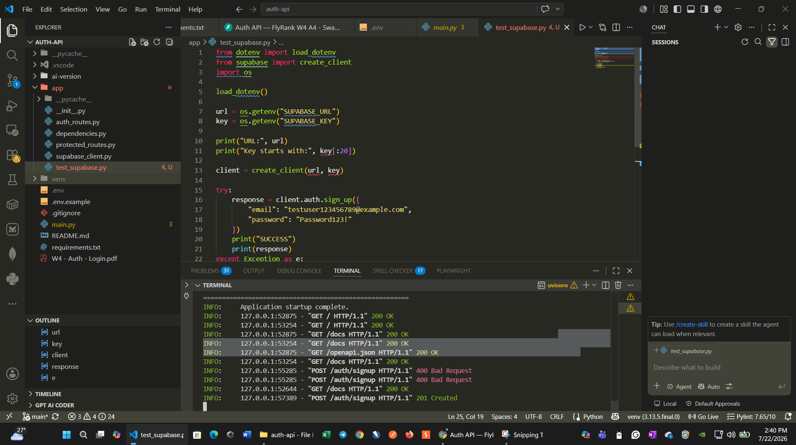
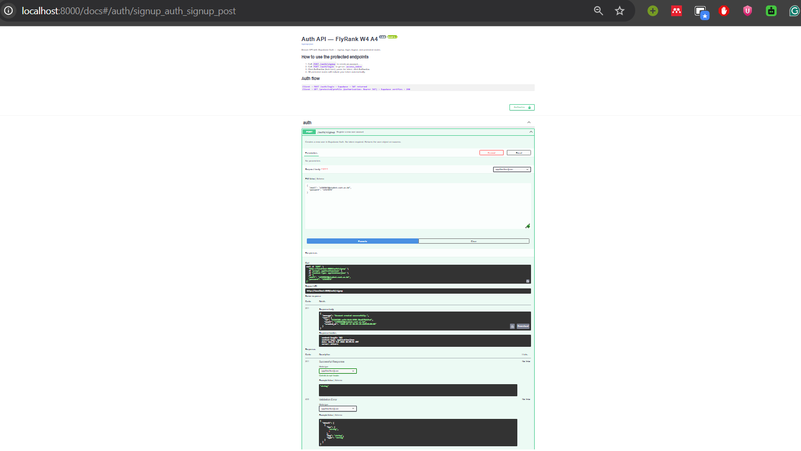
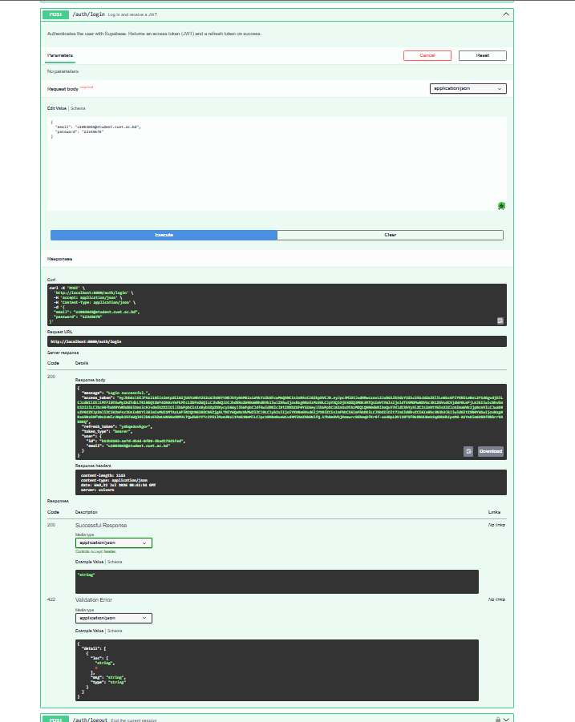
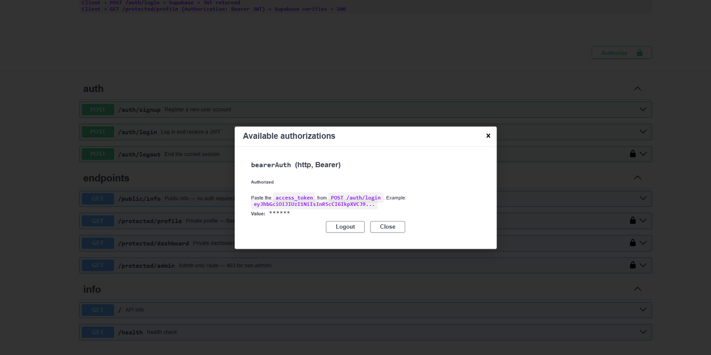
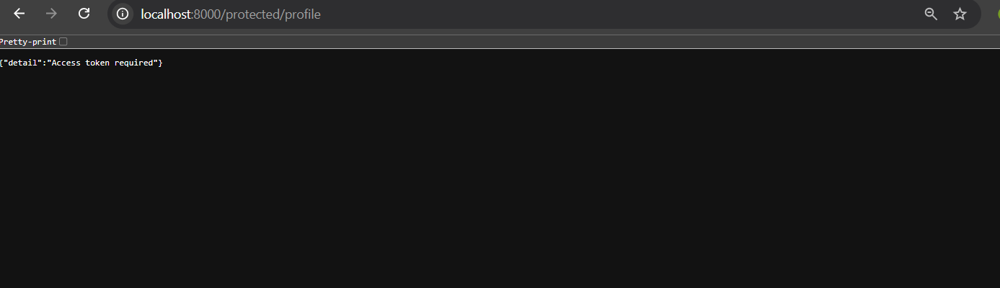
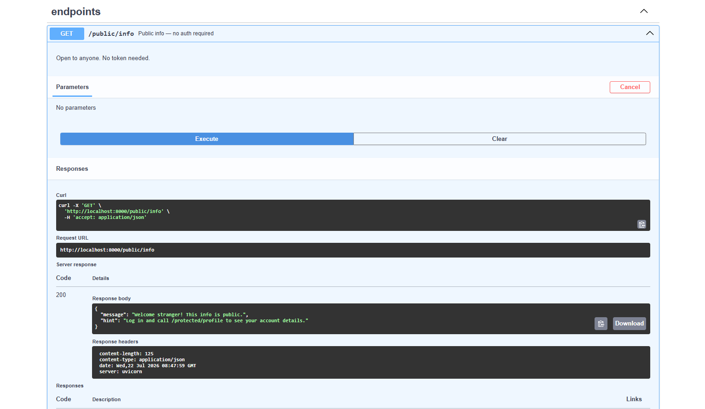
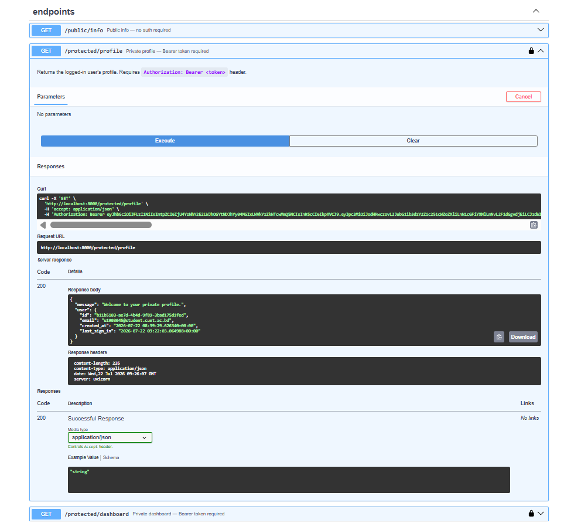
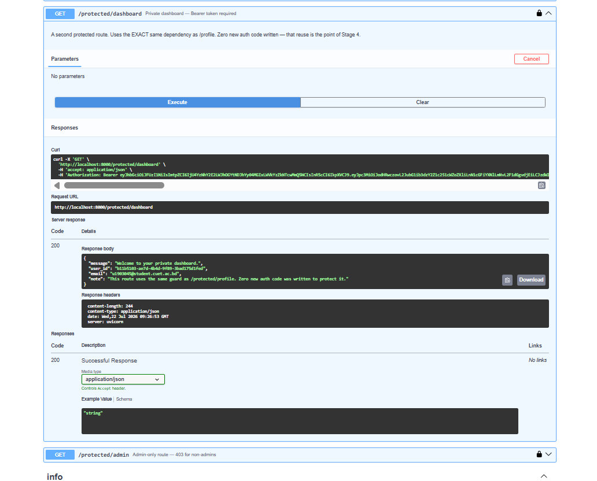
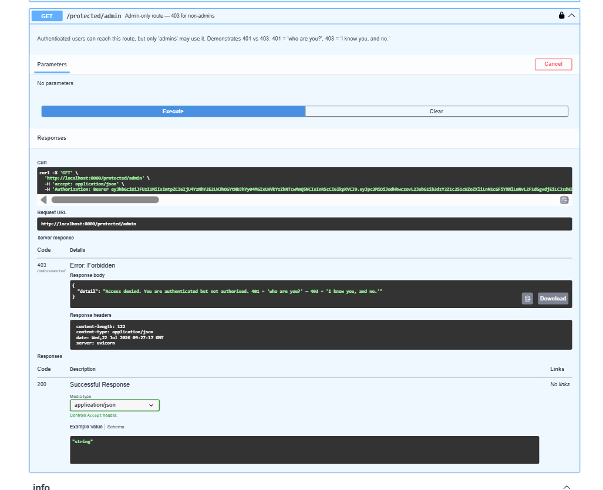

# Auth API

A secure FastAPI authentication service powered by Supabase Auth, designed for signup, login, logout, JWT verification, protected endpoints, and Swagger-based API testing.

## Overview

This project demonstrates a clean backend authentication flow using FastAPI and Supabase. Instead of storing or hashing passwords inside the application, the API delegates identity verification and password handling to Supabase Auth.

The result is a modular, production-friendly structure where:

- the client sends credentials to `POST /auth/login`
- Supabase validates the credentials and issues a JWT
- the client sends that token in the `Authorization: Bearer <token>` header
- the FastAPI backend verifies the token with Supabase before allowing access

## Key Features

- User signup with Supabase Auth
- User login that returns an `access_token` and `refresh_token`
- JWT-protected routes with reusable dependency-based authorization
- Public and private endpoints
- Swagger UI with Bearer token authorization support
- Clean separation of concerns across router and dependency modules

## Tech Stack

- FastAPI
- Supabase Python SDK
- Uvicorn
- Python-dotenv
- Pydantic

## Architecture

The app follows a simple trust model:

```text
Client → FastAPI API → Supabase Auth → JWT issued/validated
```

A reusable `get_current_user()` dependency verifies the incoming Bearer token before any protected route is executed. That keeps the authentication logic centralized and easy to reuse.

## Project Structure

```text
auth-api/
├── main.py
├── requirements.txt
├── .env
├── README.md
├── app/
│   ├── auth_routes.py
│   ├── dependencies.py
│   ├── protected_routes.py
│   └── supabase_client.py
└── ai-version/
    ├── main.py
    └── PROMPT.md
```

## Environment Setup

1. Create a Supabase project in the Supabase dashboard.
2. In Project Settings → API, copy:
   - `SUPABASE_URL`
   - `SUPABASE_KEY`
3. Add these values to a local `.env` file.
4. Never commit your `.env` file.

Example:

```env
SUPABASE_URL=https://your-project.supabase.co
SUPABASE_KEY=your-anon-key
```

## Install and Run

```bash
pip install -r requirements.txt
uvicorn main:app --reload
```

Once running, open:

- API docs: http://localhost:8000/docs
- Health check: http://localhost:8000/health

## API Endpoints

| Method | Endpoint | Description |
|---|---|---|
| `POST` | `/auth/signup` | Register a new user |
| `POST` | `/auth/login` | Authenticate and receive JWT tokens |
| `POST` | `/auth/logout` | Sign out the current authenticated user |
| `GET` | `/public/info` | Open public route |
| `GET` | `/protected/profile` | Returns protected user profile details |
| `GET` | `/protected/dashboard` | Protected dashboard endpoint |
| `GET` | `/protected/admin` | Admin-only demonstration route |
| `GET` | `/health` | Health check |

## Example Auth Flow

```bash
curl -X POST http://localhost:8000/auth/signup \
  -H "Content-Type: application/json" \
  -d '{"email":"user@example.com","password":"YourPass123!"}'

curl -X POST http://localhost:8000/auth/login \
  -H "Content-Type: application/json" \
  -d '{"email":"user@example.com","password":"YourPass123!"}'

curl http://localhost:8000/protected/profile \
  -H "Authorization: Bearer <access_token>"
```

## Swagger Authorization

The FastAPI docs are configured to support Bearer authentication. In the Swagger UI:

1. Open `/docs`
2. Click the Authorize button
3. Paste the `access_token` returned by `/auth/login`
4. Execute protected requests directly from the browser

## Security Notes

- Tokens are verified through Supabase, not by decoding locally in application code.
- The application uses the public/anon key pattern for client-facing authentication interactions.
- Sensitive credentials are stored in `.env` and excluded from version control.

## Screenshots

### Project Workspace and API Setup



### Signup Flow



### Login Flow



### Swagger Bearer Authorization



### Protected Authorization Response



### Public Info Endpoint



### Protected Profile Endpoint



### Protected Dashboard Endpoint



### Admin Protection Demo



## Notes

This project is a learning-focused implementation that shows how to wire a simple, secure authentication backend with FastAPI and Supabase while keeping the codebase readable and maintainable.

